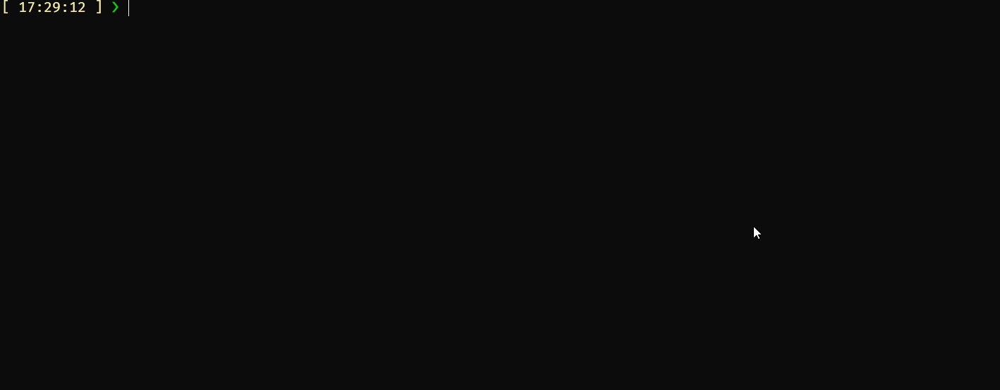

# Ktop - Kubernetes Nodes Resource Allocation Printer
ktop is a command-line tool for retrieves resource metrics for Kubernetes nodes and pods and prints them in a tabular format.

## Last Build
[](https://github.com/VegaCorporoptions/Ktop/actions/workflows/go.yml)

## Prerequisites

Before using this application, ensure you have the following prerequisites:

- Go installed on your system. (to build)
- `kubectl` configured with access to your Kubernetes cluster.

## Installation

1. Clone the repository to your local machine:

```bash
git clone https://github.com/VegaCorporoptions/Ktop
cd your-repo
```

Build the Go application:
```bash
go build .
```

## Download Ktop Executable
You can download the executable for Ktop directly from the latest release with its version. This allows you to use Ktop without the need to build it yourself. Here are the steps to download the executable for your system:
1. Visit the [Releases](https://github.com/VegaCorporoptions/Ktop/releases/latest) page.

## Usage
To list metrics for all node, run the application without any arguments:
```bash
Ktop
```

To list metrics for a specific node, provide the node name as an argument:
```bash
Ktop node
```
Application will display the resource usage and limits for pods within the specified namespace.

## Output
The application outputs (Ktop) the following metrics in a tabular format:
| Pod total capacity on Node          | CPU Usage | CPU Request | MEM Usage | Mem Request |
|-------------------------------------|-----------|-------------|-----------|-------------|
| aks-computespot-51019700-vmss0000h2 | 90 m      | 2615 m      | 15.1GiB m | 9.619GiB    |

| Node                                | CPU Capacity | CPU Allocatable | Mem Capacity | Mem Allocatable |
|-------------------------------------|--------------|-----------------|--------------|-----------------|
| aks-computespot-51019700-vmss0000h2 | 8000 m       | 7820 m          | 31.34GiB m   | 27.05Gib.62GiB  |

<br>
The application outputs (Ktop node) the following metrics in a tabular format:

Metrics for Namespace: networking
| Pods on aks-sys-41857182-vmss0000ue     | Container | CPU Usage | CPU Request | CPU Limit | Mem Usage | Mem Request | Mem Limit | Spot Tolerance |
|-----------------------------------------|-----------|-----------|-------------|-----------|-----------|-------------|-----------|----------------|
| helm-controller-6c96bf97fc-5ggxf        | manager   | 6 m       | 100 m       | 1000 m    | 35.73MiB  | 64MiB       | 1GiB      | true           |
| kustomize-controller-6685765665-s4snn   | manager   | 32 m      | 100 m       | 1000 m    | 79.49MiB  | 64MiB       | 1GiB      |                |
| notification-controller-f6956b9bd-m82j4 | manager   | 2 m       | 100 m       | 1000 m    | 28.16MiB  | 64MiB       | 1GiB      |                |
| source-controller-7c8f657856-sr7ll      | manager   | 17 m      | 50 m        | 1000 m    | 97.42MiB  | 64MiB       | 1GiB      |                |
| ...                                     | ...       | ...       | ...         | ...       | ...       | ...         | ...       |                |

# Demo


## License
This project is licensed under the MIT License. See the LICENSE file for details.
